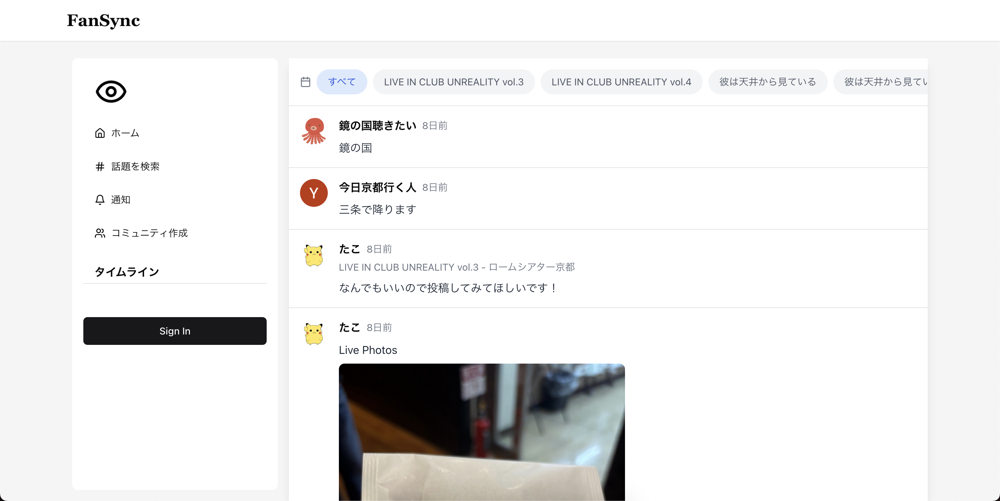

## コミュニティプラットフォーム（アプリ名未定、開発中）

#### アプリのリンク
https://fan-community.vercel.app/

アプリ画面

##### 進捗
- コミュニティごとのタイムライン実装

### 概要

- ファンコミュニティごとにタイムラインを分けたSNS
- ノイズ（関係ない話）が交じることのないタイムラインで、アーティストの話をファン同士でシェアできる
- リアルタイムでファン同士が情報をシェアできるプラットフォーム
- Spotify連携による音楽体験の強化と共有

### 実装したい機能
1. **コミュニティ別タイムライン**
    - X（旧Twitter）ライクなインターフェースで各コミュニティの最新情報を表示
2. **ライブイベント情報ハブ**
    - 会場アクセス情報
    - グッズ販売状況のリアルタイム更新
    - 入場列の現況レポート
3. **ユーザープロフィール**
    - 推しアーティスト設定
    - 参加コミュニティの管理
4. **Spotify連携機能**
    - ユーザーの再生履歴表示
    - トップトラックとトップアーティストの表示
    - プレイリストの共同編集機能
5. **音楽データ共有**
    - Spotifyのデータを基にした音楽趣味の可視化
    - コミュニティ内での音楽傾向分析
6. **アーティスト情報データベース**
    - Wikipediaのように誰でも編集できる

### 技術
- Next.js 14.2
- 認証
    - Next-auth 5.0.0-beta.21
- DB
    - Vercel Postgres
- ORM
    - Prisma
- デプロイ先
    - Vercel

### ER図

### 問題
開発中に起きた問題はZennのスクラップに残していきます
[コミュニティプラットフォーム開発中に詰まったところ](https://zenn.dev/atnuhs/scraps/575baa55b1b80f)